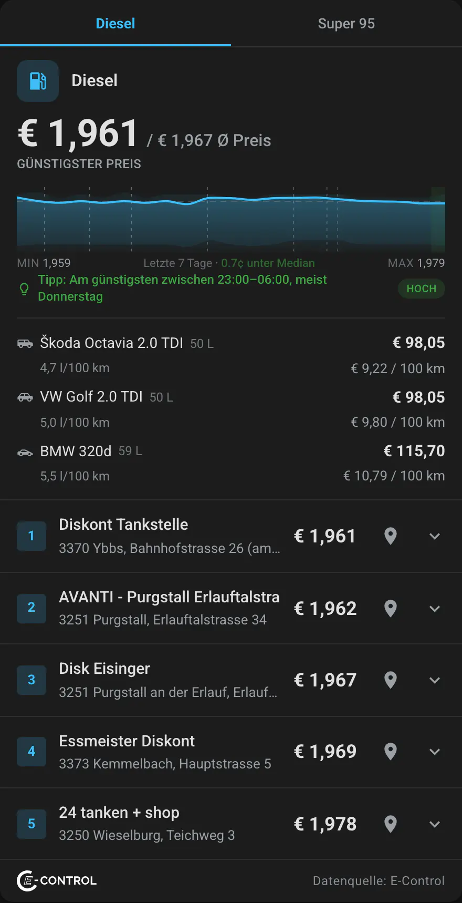
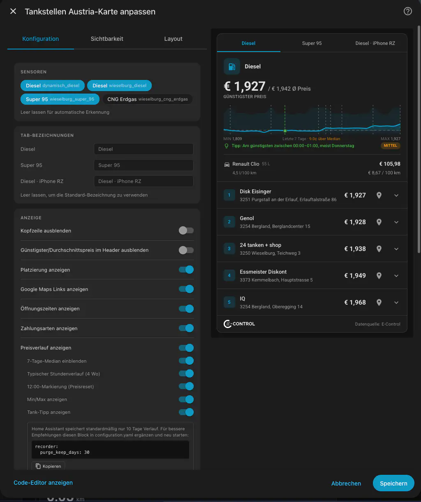
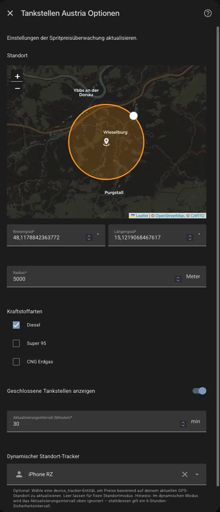

# Tankstellen Austria

[](https://github.com/hacs/integration)
[](https://www.home-assistant.io/)
[](https://github.com/rolandzeiner/tankstellen-austria/releases)
[](https://opensource.org/licenses/MIT)

Home Assistant integration for Austrian fuel prices via the
[E-Control Spritpreisrechner API](https://www.e-control.at/spritpreisrechner).

Shows the 5 cheapest fuel stations near your location for Diesel, Super 95,
and/or CNG.

## Features

- **Config-flow UI** – set up via the HA integrations page (map picker for coordinates)
- **One sensor per fuel type** – state = cheapest price, attributes contain all 5 stations with name, address, opening hours, and Google Maps link
- **Custom Lovelace card** – `tankstellen-austria-card` with fuel-type tabs, expandable opening hours, map links, and 7-day price sparkline
- **Auto-detection** – the card automatically finds all Tankstellen Austria sensors, no manual entity configuration needed
- **Visual card editor** – configure everything through the HA UI
- **Average price tracking** – average of all 5 stations as sensor attribute, tracked in HA history for long-term analysis
- **Dynamic mode** *(1.4.0)* – track a `device_tracker` entity (e.g. your phone) and automatically refresh nearby prices as you drive, with distance threshold and rate limiting
- **Closing Soon badge** *(1.4.0)* – amber badge on stations that close within the next 30 minutes
- **Translations** – German and English included
- **No API key required** – the E-Control API is public
- **Reconfigurable** – change location, fuel types, update interval, or dynamic mode any time via the "Configure" button

## Screenshots

<table>
  <tr>
    <td align="center"></td>
    <td align="center"></td>
    <td align="center"></td>
  </tr>
  <tr>
    <td align="center"><em>Lovelace card</em></td>
    <td align="center"><em>Card editor</em></td>
    <td align="center"><em>Config flow</em></td>
  </tr>
</table>

## Requirements

- Home Assistant **2024.6** or newer

## Installation

### HACS (recommended)

1. Open HACS → **Integrations** → three-dot menu → **Custom repositories**
2. Add `https://github.com/rolandzeiner/tankstellen-austria` as type **Integration**
3. Search for "Tankstellen Austria" and install
4. Restart Home Assistant

[](https://my.home-assistant.io/redirect/hacs_repository/?owner=rolandzeiner&repository=tankstellen-austria&category=integration)

### Manual

1. Copy `custom_components/tankstellen_austria/` to your HA `config/custom_components/` directory
2. Restart Home Assistant

## Setup

1. Go to **Settings → Devices & Services → + Add Integration**
2. Search for **Tankstellen Austria**
3. Enter a name, pick your location on the map, select fuel types, configure the update interval, and optionally select a dynamic location tracker
4. Save and restart if prompted

To change settings later, go to **Settings → Devices & Services**, find the integration, and click **Configure**.

## Dynamic Mode

Dynamic mode lets the integration follow you as you drive, refreshing nearby fuel prices based on your current GPS position rather than a fixed coordinate.

### How to enable

Select a **device tracker** entity (e.g. `device_tracker.your_iphone`) in the **"Dynamic location tracker"** field — either during initial setup or via the **Configure** button on an existing entry.

The fixed location you set during setup becomes the **fallback**: used when the tracker entity has no GPS coordinates (e.g. zone-based trackers or when the device is offline).

### Update logic

Updates are triggered by location-change events on the tracker entity, subject to these guards:

| Guard | Value | Purpose |
|-------|-------|---------|
| Distance threshold | 1.5 km | Ignore small movements (walking, parking drift) |
| Per-entry cooldown | 10 min | Prevent rapid re-queries after moving |
| Domain-wide cooldown | 5 min | Protect against multiple entries firing simultaneously |
| Safety-net timer | 6 hours | Keeps data fresh if the tracker stops reporting |

### Dynamic card behaviour

When a dynamic entry is active, the card header changes:

- Prices (cheapest / average) are **hidden** — not meaningful for a moving location
- **"Updated: HH:MM"** shows when the data was last fetched
- A **Refresh button** triggers an immediate update with a 2-minute cooldown; while cooling down the button shows a live countdown (`1:59 → 0:00`) so you always know when it will be available again
- In multi-tab cards, dynamic tabs are labelled **"Diesel · iPhone"** (tracker friendly name) to distinguish them from fixed tabs

> **Note:** The 7-day price sparkline is hidden in dynamic mode — history from varying locations is not meaningful.

### Using fixed and dynamic entries together

You can have both a fixed entry (e.g. home) and a dynamic entry (e.g. iPhone) active at the same time. Add both sensors to a single card and they appear as separate tabs — each tab behaves according to its own mode. For separate dashboards, configure each card's `entities` list manually to show only the desired sensors.

## Lovelace Card

The integration auto-registers the card JS on startup. If it wasn't picked up automatically, add it manually:

**Settings → Dashboards → Resources → Add Resource**

| URL | Type |
|-----|------|
| `/tankstellen-austria/tankstellen-austria-card.js` | JavaScript Module |

Then add the card to your dashboard. The simplest setup auto-detects all sensors:

```yaml
type: custom:tankstellen-austria-card
```

Or configure manually:

```yaml
type: custom:tankstellen-austria-card
entities:
  - sensor.tankstellen_wieselburg_diesel
  - sensor.tankstellen_wieselburg_super_95
max_stations: 3
show_map_links: true
show_opening_hours: true
show_history: true
```

### Card options

| Option | Default | Description |
|--------|---------|-------------|
| `entities` | auto-detect | List of Tankstellen Austria sensor entities |
| `max_stations` | `5` | Number of stations to show (1–5) |
| `language` | HA language | `de` or `en` |
| `show_map_links` | `true` | Show Google Maps link per station |
| `show_opening_hours` | `true` | Show expandable opening hours on click |
| `show_history` | `true` | Show 7-day sparkline price graph (fixed mode only) |

### What the card shows

**Fixed mode:**
- Fuel type header with cheapest price and average price (Ø)
- 7-day sparkline of cheapest price history with min/max labels
- Station list ranked by price with name, address, and map link
- Opening hours expandable per station on click
- **Closed** badge (red) on currently closed stations
- **Closing Soon** badge (amber) on stations closing within 30 minutes

**Dynamic mode (additional/different):**
- Tab label includes tracker name — e.g. "Diesel · iPhone"
- Header shows **"Updated: HH:MM"** instead of prices
- **Refresh** button with live countdown cooldown (2 min)
- Sparkline hidden

## Sensors

Each fuel type creates one sensor:

| Sensor | State | Unit |
|--------|-------|------|
| `sensor.tankstellen_{name}_{fuel_type}` | Cheapest price | €/l |

**Attributes** on each sensor:

| Attribute | Description |
|-----------|-------------|
| `fuel_type` | DIE / SUP / GAS |
| `fuel_type_name` | Diesel / Super 95 / CNG Erdgas |
| `station_count` | Number of stations with prices |
| `average_price` | Average price across all stations |
| `stations` | List of station objects (id, name, price, open, location, opening_hours) |
| `dynamic_mode` | `true` when the entry tracks a device_tracker entity |
| `dynamic_entity` | Entity ID of the tracked device_tracker (dynamic mode only) |

## API Info

- **Base URL**: `https://api.e-control.at/sprit/1.0/search/gas-stations/by-address`
- **Rate limit**: Don't poll more than every 10 minutes (60 minutes is safe)
- **No API key** required
- Returns 5 cheapest stations (with prices) + surrounding stations (without)
- All requests include a `User-Agent` header identifying the integration and HA version

### Important Notes

* **Price vs. Distance**: The API returns the five cheapest stations in the area, not necessarily the ones closest to your coordinates.
* **Average Price Calculation**: The `average_price` attribute is calculated based only on the five cheapest stations retrieved. It is not a representative average for all stations in the region.
* **Geographic Scope**: Only stations located within Austria are included. Stations in neighbouring countries are not covered by the E-Control API.

## Removal

1. Go to **Settings → Devices & Services**, find the Tankstellen Austria integration, and click the three-dot menu → **Delete**
2. Restart Home Assistant
3. Remove the `custom_components/tankstellen_austria/` directory from your HA config (manual installs only — HACS removes it automatically)

## License

MIT – see [LICENSE](LICENSE)

## Disclaimer

This integration is not affiliated with or endorsed by E-Control Austria. All fuel price data is provided by the [E-Control Spritpreisrechner API](https://www.e-control.at/spritpreisrechner) and is subject to their terms and conditions. The developer assumes no liability for the accuracy, completeness, or timeliness of the displayed prices. Use at your own risk.

---

Diese Integration steht in keiner Verbindung zur E-Control Austria und wird von dieser nicht unterstützt. Alle Spritpreisdaten stammen von der [E-Control Spritpreisrechner API](https://www.e-control.at/spritpreisrechner). Für die Richtigkeit, Vollständigkeit und Aktualität der angezeigten Preise wird keine Haftung übernommen. Nutzung auf eigene Verantwortung.
